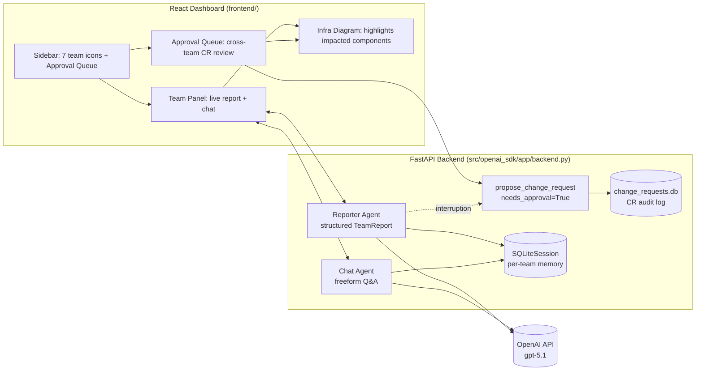

# IT Ops Assistant

A hands-on curriculum for the [OpenAI Agents SDK](https://github.com/openai/openai-agents-python), built step by step into a working reference implementation: a multi-team **IT Operations dashboard** where real AI agents monitor infrastructure domains, propose change requests, and route them through human-in-the-loop manager approval before anything happens.

This repository is two things at once:

1. **A 22-step, runnable curriculum** (`src/openai_sdk/lessons/`) that takes the Agents SDK from "hello world" to production-hardening concerns — guardrails, human approval, MCP, deployment, evals, and prompt-injection defense — with every concept demonstrated against real IT-infrastructure examples, not toy demos.
2. **A working application** (`src/openai_sdk/app/` + `frontend/`) that applies everything from the curriculum to a genuine use case: seven specialized IT Ops team agents, each reporting live status and proposing change requests, reviewed by a manager through a real approval workflow with a full audit trail.

---

## Why this exists

Most agent-framework tutorials stop at "call a tool." This project was built to answer a harder question: **what does it actually take to run an LLM agent against real infrastructure, safely, with a human accountable for every consequential decision?**

Every lesson is grounded in that question:

- Safety concepts (guardrails, approval gates) were pulled **ahead** of convenience features (structured outputs, multi-agent handoffs) in the curriculum ordering, because they were treated as non-negotiable before anything else shipped.
- Several lessons exist specifically to **demonstrate failure modes live** — a guardrail that doesn't catch what you'd assume it catches, a model that misuses a destructive tool when no safe alternative exists, a remote tool result that tries to hijack the agent — before showing the fix, so the risk isn't just asserted, it's proven.
- The final application doesn't retreat to mocked data once things get real: several tools genuinely inspect this machine (disk usage, running processes, network reachability) and one genuinely restarts a real OS process, gated behind the same approval mechanism a production deployment would need.

---

## Architecture



Seven team agents run as pairs (a structured **reporter** and a freeform **chat** agent) sharing one `SQLiteSession` each, so switching between "give me your status" and "let me ask a follow-up" never loses context. Any agent can call `propose_change_request` — a tool marked `needs_approval=True`, which unconditionally pauses execution and hands control to the manager, regardless of what the model decides. Nothing the agents propose takes effect without that explicit human decision.

---

## The application: IT Ops Dashboard

### Teams

| Team | Domain | Real tools it can call |
|---|---|---|
| 🛡️ Vulnerability Management | CVE tracking, patch/upgrade planning | — |
| 🔒 Ops Security (SOC) | Alert monitoring, incident response | Real host ping, real process listing |
| 🗡️ Red Team | Offensive testing, remediation recs | — |
| 📶 Wireless Team | WLAN infra, AP/controller health | Real host ping |
| 🪪 ISE / NAC Team | Network access control, posture | Real host ping |
| 🌐 Routing Domain | Core/edge routing, WAN | Real host ping |
| 🧱 Firewall Ops | Firewall policy, HA pairs | Real host ping |

Every team is a real `Agent` from the Agents SDK with its own persona and instructions — not a templated wrapper. When you open a team's panel, it generates a **structured live report**:

- **Currently Observing** — findings in its domain (explicitly framed as illustrative example scenarios; see [Data & simulation notice](#data--simulation-notice))
- **Mitigation & Upgrade Plan** — what it intends to do about them

### Change requests, with real accountability

When a team decides something needs action, it doesn't just say so — it calls `propose_change_request`, which:

1. **Pauses the run immediately** (an SDK-level interruption, not a prompt convention the model could ignore)
2. **Creates a CR record in SQLite the instant it's proposed** (`status="pending"`), so the CR ID is stable from proposal through decision — never renumbered, never lost
3. Surfaces to the manager with:
   - **CR ID** (`CR-0001`, ...)
   - **Change type** — `weekend_planned` (routine maintenance window) or `emergency_weekday` (can't wait)
   - **Risk level** — low / medium / high
   - **Configuration plan** — the actual step-by-step implementation plan, not just a summary
   - **Incident ID** — populated only when the change is a direct response to a real incident
   - **Impacted teams** — other teams tagged for visibility, so cross-team blast radius isn't hidden in one team's silo
   - **Infra impact diagram** — the team's topology (e.g. Firewall Ops: `Internet Edge → Perimeter Firewall (HA Pair) → DMZ → Internal Firewall → Core Network`) rendered with the specific components this CR touches highlighted, so the manager can assess blast radius at a glance instead of reading a paragraph
4. **Waits for an explicit Approve or Reject** — anything not explicitly approved is rejected by default (fail closed, not open)
5. **Resumes the agent with that decision**, which then adapts its plan accordingly (a rejected CR gets re-scoped in the same report, not silently dropped)

Every decision — approved or rejected, from any team, from either the team's own panel or the cross-team **Approval Queue** — lands in a persistent audit log (`change_requests.db`) with a full timestamp trail from proposal to decision.

### Screens

- **Team Panel** — live status report (two cards: observations / mitigation plan), an ad hoc chat box to ask that team follow-up questions, and inline approval cards when a CR is pending.
- **Approval Queue** — every pending CR across all seven teams in one place, so the manager never has to tab-hunt; a collapsible **Recent Decisions** history below it for full traceability.

---

## The curriculum

22 self-contained, independently runnable lessons under `src/openai_sdk/lessons/`. Each one is a single script you can read top to bottom and then execute to see the real behavior it teaches — no lesson depends on running another first.

| # | Lesson | What it teaches |
|---|---|---|
| 1 | `step1_hello_agent.py` | Minimal `Agent` + `Runner` |
| 2 | `step2_core_concepts.py` | Explicit model config, multi-turn via `to_input_list()`, inspecting `RunResult` |
| 3 | `step3_function_tools.py` | `@function_tool` |
| 4 | `step4_guardrails.py` | `@input_guardrail` with an LLM classifier — and a demonstrated gap: guardrails classify user *text*, not the tool the model ends up calling |
| 4 | `step4_structured_outputs.py` | `output_type=<PydanticModel>` |
| 5 | `step5_human_approval.py` | `needs_approval=True` — the actual hard runtime gate; guardrails alone don't stop execution |
| 5 | `step5_multi_agent_handoffs.py` | Triage agent + specialist `handoff()` |
| 6 | `step6_sessions.py` / `step6_sessions_resume.py` | `SQLiteSession` — cross-process persistence, proven by resuming from a second process |
| 7 | `step7_tracing.py` | `trace(workflow_name=...)` grouping |
| 8 | `step8_mcp.py` | A real local MCP server over stdio |
| 9 | `step9_fastapi_service.py` | Agent behind a FastAPI service with sessions + guardrails |
| 10 | `step10_approval_over_http.py` | Parking an interrupted run across two HTTP requests (`/chat`, `/approve`) |
| 11 | `step11_hardened_service.py` | API-key auth, SQLite-persisted approvals surviving a process crash |
| 12 | `step12_rate_limit_tracing.py` | Per-key rate limiting, linking multi-request traces via `group_id` |
| 13 | `step13_redis_multiworker.py` | Redis-backed shared state across real multi-worker uvicorn processes |
| 14 | `step14_secure_config.py` | Redis auth, centralized fail-fast config |
| 15 | `step15_agents_as_tools.py` | `agent.as_tool()` vs. `handoff()` — orchestrator keeps control, calls multiple specialists in one turn |
| 16 | `step16_context_dependency_injection.py` | Dynamic instructions + `RunContextWrapper` for per-user authorization |
| 17 | `step17_streaming.py` | `Runner.run_streamed()`, token-level and item-level events |
| 18 | `step18_cost_usage_tracking.py` | Real `Usage` accounting, per-request cost breakdown |
| 19 | `step19_evals.py` | A CI-gateable eval harness: deterministic assertions + pass-rate thresholds for nondeterministic model behavior |
| 20 | `step20_remote_mcp_output_guardrails.py` | MCP over HTTP (`MCPServerStreamableHttp`) + `@output_guardrail` |
| 21 | `step21_tool_output_injection_defense.py` | A live prompt-injection attack via a poisoned tool result, and the `ToolOutputGuardrail` defense |
| 22 | `step22_real_infra_integration.py` | Swapping every mocked tool for genuinely real ones — real process data, real ping, a real (safely scoped) process restart |

Run any lesson directly:

```bash
uv run python src/openai_sdk/lessons/step5_human_approval.py
```

> **Windows note:** set `PYTHONIOENCODING=utf-8` when running lessons — the default console codepage can otherwise mangle or crash on Unicode in model output.

---

## Data & simulation notice

**No live monitoring feed, CVE database, or SIEM is wired into this project.** Every team agent is explicitly instructed to frame its "observations" (CVEs, alerts, findings) as illustrative example scenarios for demonstration purposes — never as verified real-world threat intelligence. If you demo this application to others, make that framing explicit; the realistic phrasing is intentional (it's what makes the approval workflow meaningful to exercise) but should never be mistaken for a live feed.

---

## Getting started

### Prerequisites

- Python 3.11+
- [uv](https://docs.astral.sh/uv/)
- Node.js 20+ and npm
- An OpenAI API key with access to the model configured in the code (`gpt-5.1`)

### 1. Configure your API key

Create a `.env` file in the repository root (never commit this file — it's already gitignored):

```
OPENAI_API_KEY=sk-...
```

### 2. Install dependencies

```bash
# Python backend + lessons
uv sync

# Frontend
cd frontend
npm install
```

### 3. Run the dashboard

```bash
# Terminal 1 — backend (from repo root)
uv run uvicorn openai_sdk.app.backend:app --port 8010

# Terminal 2 — frontend
cd frontend
npm run dev
```

Open **http://localhost:5173**. The backend must be running first — the frontend expects it at `http://127.0.0.1:8010` (CORS is configured for the default Vite dev port; adjust `allow_origins` in `backend.py` if you serve the frontend elsewhere).

### 4. Run any curriculum lesson

```bash
uv run python src/openai_sdk/lessons/step1_hello_agent.py
```

Some lessons (8, 20, 21) spawn their own local MCP server as a subprocess and clean it up on exit — no separate setup needed. Steps 13-14 expect a local Redis instance (`docker run -d --name lesson-redis -p 6379:6379 redis:alpine`).

---

## Project structure

```
├── src/openai_sdk/
│   ├── lessons/              # 22 standalone, runnable curriculum scripts
│   └── app/
│       └── backend.py        # FastAPI backend for the IT Ops dashboard
├── frontend/
│   └── src/
│       ├── App.jsx            # Top-level state, routing between teams/queue
│       ├── Sidebar.jsx        # Team icons + Approval Queue nav
│       ├── TeamPanel.jsx      # Per-team report + chat
│       ├── ApprovalQueue.jsx  # Cross-team approval + decision history
│       ├── ApprovalCard.jsx   # CR detail card (plan, diagram, tags)
│       ├── InfraDiagram.jsx   # Topology visualization with impact highlighting
│       └── api.js             # Backend fetch client
├── pyproject.toml
└── uv.lock
```

---

## What this project deliberately does not include

This is a focused reference implementation, not a hardened production deployment. Scope was kept intentionally narrow so the interesting parts (agent behavior, safety mechanisms, approval workflow) aren't buried under infrastructure:

- **No authentication** on the dashboard API (Steps 11 and 14 in the curriculum show how to add API-key auth and centralized secret config — not wired into the app)
- **No Redis / multi-worker deployment** (Step 13 shows the pattern; the app runs single-process with in-memory pending-approval state, so a backend restart loses any run parked mid-approval)
- **No rate limiting** (Step 12 shows the pattern)
- **No real monitoring/vulnerability data source** — see [Data & simulation notice](#data--simulation-notice)
- **Single-manager approval model** — CRs tag other teams for visibility, not as a separate multi-party sign-off chain (that would require per-team identities/auth, a deliberate scope decision)

Each of these is a natural next step, and the curriculum already demonstrates the underlying pattern for most of them.

---

## Tech stack

**Backend:** Python 3.11, [OpenAI Agents SDK](https://github.com/openai/openai-agents-python), FastAPI, SQLite, `psutil`
**Frontend:** React 19, Vite, plain CSS (no UI framework dependency)
**Model:** `gpt-5.1` via the OpenAI API
